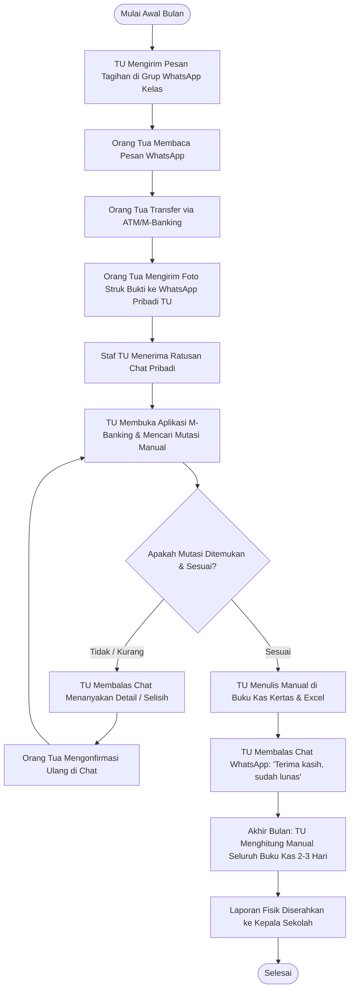
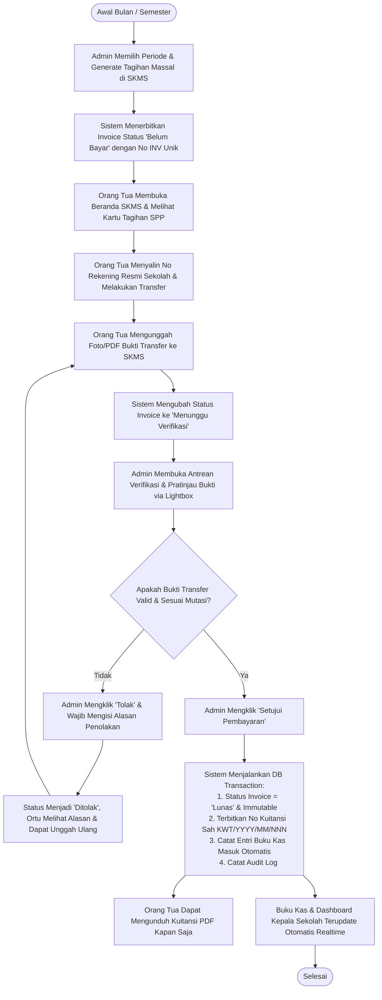
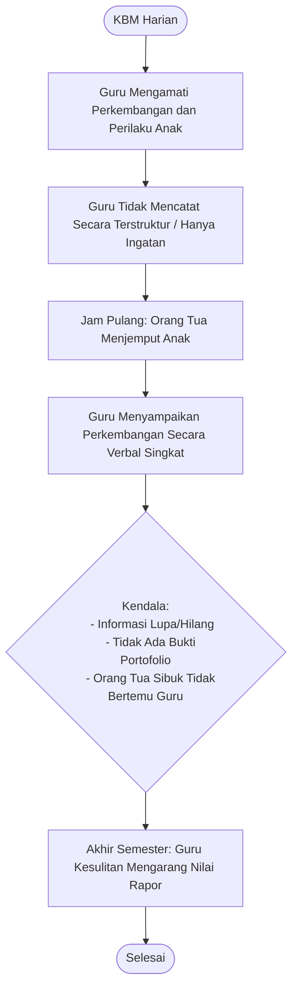
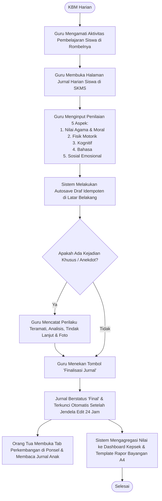
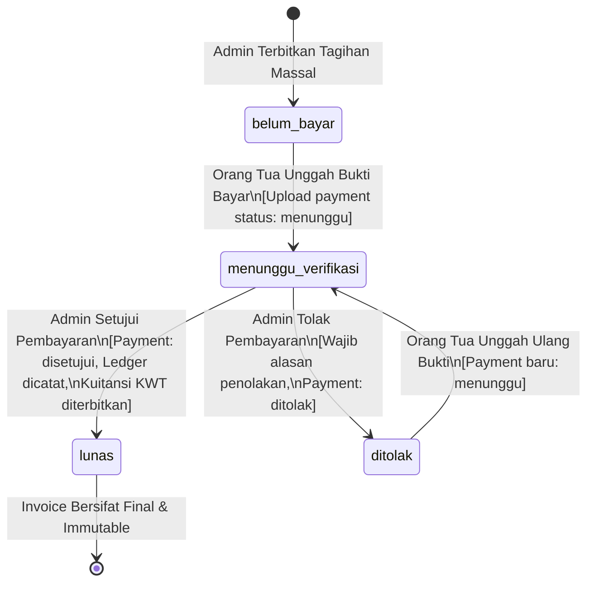
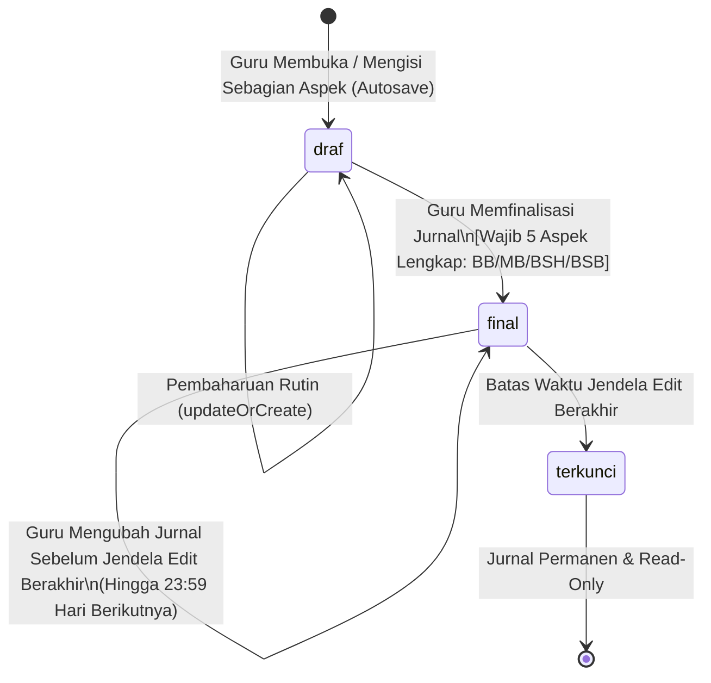
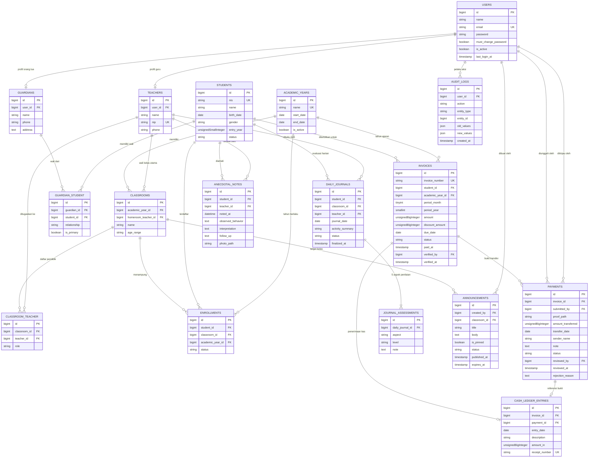

# Dokumen Capstone — Smart Kindergarten Management System (SKMS)

**Sistem Informasi Manajemen dan Keuangan Operasional Terpadu**  
**Studi Kasus:** RA Waladun Sholeh  
**Tahun Akademik:** 2026/2027  
**Penyusun:** Tim Pengembang SKMS  

---

## 1. Pendahuluan dan Latar Belakang Masalah

### 1.1. Profil Organisasi dan Konteks Operasional
RA (Raudhatul Athfal) Waladun Sholeh merupakan institusi pendidikan anak usia dini yang melayani sekitar 78–80 siswa aktif yang terbagi dalam dua kelompok belajar (Kelompok A dan Kelompok B). Seluruh tata kelola manajerial, pencatatan keuangan, dan administrasi sekolah dikelola oleh **1 orang staf Tata Usaha (TU)**, didampingi oleh dewan pendidik dan dipimpin oleh Kepala Sekolah.

### 1.2. Identifikasi Masalah Utama (*Problem Statement*)
Melalui observasi dan wawancara lapangan, ditemukan tiga kendala krusial dalam operasional harian:
1. **Beban Kerja Rekapitulasi Manual yang Tinggi:**
   Pencatatan pembayaran SPP dan pembuatan laporan kas bulanan memakan waktu 2 hingga 3 hari kerja penuh karena data dicatat ganda pada buku besar kertas dan lembar kerja spreadsheet terpisah.
2. **Verifikasi Pembayaran SPP Tercecer dan Rentan Sengketa:**
   Bukti transfer bank dikirimkan oleh wali murid melalui obrolan pribadi WhatsApp ke nomor staf TU. Berkas bukti kerap tertimbun, tidak memiliki penomoran resmi kuitansi, verifikasi mutasi bank tidak tercatat secara atomik, dan orang tua tidak memiliki transparansi status tagihan (Belum Bayar, Menunggu Verifikasi, Lunas, atau Ditolak).
3. **Asesmen Perkembangan Anak Bersifat Lisan Tanpa Rekam Jejak:**
   Evaluasi harian siswa hanya disampaikan secara verbal saat jam penjemputan anak. Tidak tersedia data capaian jangka panjang berbasis 5 aspek perkembangan standar PAUD (Nilai Agama & Moral, Fisik Motorik, Kognitif, Bahasa, Sosial Emosional), sehingga pembuatan laporan perkembangan semesteran menjadi beban berat bagi guru.

### 1.3. Tujuan Sistem
SKMS dibangun sebagai solusi terpadu untuk:
- Mengotomatisasi siklus penagihan dan pembukuan kas (pembayaran lunas langsung membukukan penerimaan kas secara atomik).
- Memusatkan verifikasi pembayaran dengan penyimpanan bukti pada media penyimpanan privat yang aman.
- Menyediakan instrumen jurnal harian digital dan catatan anekdot terstruktur dengan hak akses berdasar wali kelas.
- Menyajikan transparansi tagihan, kuitansi digital, dan jurnal perkembangan kepada orang tua secara mandiri.
- Menyajikan dashboard eksekutif dan pelaporan otomatis (PDF & Excel) bagi Kepala Sekolah untuk pengambilan keputusan strategis.

---

## 2. Model Pengguna dan Aktor Sistem

Sistem menerapkan Role-Based Access Control (RBAC) berbasis `spatie/laravel-permission` dengan 4 aktor utama:

| Aktor / Role | Deskripsi Tanggung Jawab | Perangkat Kerja Utama |
|---|---|---|
| **Admin (Tata Usaha)** | Pengelolaan data master (siswa, orang tua, guru, kelas), penerbitan tagihan SPP massal, peninjauan & verifikasi bukti transfer, pemantauan buku kas, dan penerbitan pengumuman. | Komputer Desktop / Laptop |
| **Guru (Pendidik)** | Pengisian jurnal harian 5 aspek siswa di kelasnya, pencatatan observasi anekdot berkamera/lampiran foto, dan pemantauan riwayat capaian anak. | Tablet / Telepon Pintar (Mobile) |
| **Kepala Sekolah** | Pengawasan menyeluruh (*read-only* eksekutif), pemantauan metrik kelancaran SPP & tunggakan >30 hari, persentase keterisian jurnal guru, serta ekspor laporan keuangan dan evaluasi siswa. | Komputer Desktop / Laptop |
| **Orang Tua / Wali** | Pemantauan tagihan SPP anak aktif, pengunggahan bukti transfer bank, pengunduhan bukti kuitansi resmi, serta pemantauan jurnal harian & pengumuman sekolah. | Telepon Pintar (Mobile Web) |

---

## 3. Diagram Use Case Global

```mermaid
flowchart TD
    subgraph Aktor
        Admin["Admin (Tata Usaha)"]
        Guru["Guru"]
        Kepsek["Kepala Sekolah"]
        Ortu["Orang Tua / Wali"]
    end

    subgraph Modul_Master_Data["1. Master Data & Akun"]
        UC01["Kelola Siswa & Orang Tua"]
        UC02["Kelola Rombel & Wali Kelas"]
        UC03["Kelola Guru & Penugasan (Maks 3/Kelas)"]
        UC04["Reset Kata Sandi Pengguna"]
    end

    subgraph Modul_Keuangan["2. Keuangan & SPP"]
        UC05["Terbitkan Tagihan SPP Massal"]
        UC06["Unggah Bukti Transfer SPP"]
        UC07["Verifikasi Bukti (Setuju/Tolak)"]
        UC08["Kelola Buku Kas Otomatis"]
        UC09["Unduh Kuitansi Pembayaran"]
    end

    subgraph Modul_Akademik["3. Jurnal & Perkembangan Anak"]
        UC10["Input Jurnal Harian (5 Aspek)"]
        UC11["Catat Catatan Anekdot & Foto"]
        UC12["Lihat Riwayat & Matriks Jurnal"]
        UC13["Pantau Perkembangan Anak"]
    end

    subgraph Modul_Pengumuman["4. Pengumuman"]
        UC14["Publikasikan Pengumuman Ber-target"]
        UC15["Baca Pengumuman Relevan"]
    end

    subgraph Modul_Laporan["5. Analitik & Pelaporan"]
        UC16["Pantau Dashboard Eksekutif"]
        UC17["Ekspor Laporan Keuangan (PDF/XLS)"]
        UC18["Ekspor Rapor Bayangan Siswa (PDF)"]
    end

    Admin --> UC01
    Admin --> UC02
    Admin --> UC03
    Admin --> UC04
    Admin --> UC05
    Admin --> UC07
    Admin --> UC08
    Admin --> UC14
    Admin --> UC16
    Admin --> UC17
    Admin --> UC18

    Guru --> UC10
    Guru --> UC11
    Guru --> UC12
    Guru --> UC15

    Ortu --> UC06
    Ortu --> UC09
    Ortu --> UC13
    Ortu --> UC15

    Kepsek --> UC16
    Kepsek --> UC17
    Kepsek --> UC18
    Kepsek --> UC15
```

---

## 4. Tabel Rincian Spesifikasi Use Case

### 4.1. Modul 1 — Master Data dan Pengguna
| ID | Nama Use Case | Aktor Utama | Kondisi Awal (*Preconditions*) | Alur Utama Singkat | Kondisi Akhir (*Postconditions*) |
|---|---|---|---|---|---|
| **UC-01** | Tambah Siswa Baru | Admin | Admin telah login ke sistem. | Admin memasukkan data NIS, nama, tanggal lahir, kelas, dan data orang tua (nama, HP, email). Sistem membuat akun otomatis dengan kata sandi acak. | Siswa terdaftar, akun orang tua dibuat dengan `must_change_password=true`, dialog kredensial tampil sekali. |
| **UC-02** | Atur Penugasan Guru ke Kelas | Admin | Rombel dan akun guru aktif telah terdaftar. | Admin membuka modal penugasan guru, memilih rombel dan menetapkan peran (Wali Kelas Utama atau Guru Pendamping). Validasi maks 3 guru/kelas. | Pivot `classroom_teacher` diperbarui, guru lama disesuaikan jika ada wali baru, audit log tercatat. |
| **UC-03** | Pindah Kelas Siswa Massal | Admin | Siswa aktif terdaftar di tahun ajaran berjalan. | Admin memilih siswa dengan checkbox pada tabel kelas, memilih kelas tujuan, lalu menyetujui modal konfirmasi. | Data rombel pada tabel `enrollments` diperbarui secara atomik. |
| **UC-04** | Reset Kata Sandi | Admin | Akun target terdaftar. | Admin menekan tombol reset pada guru/ortu, sistem membuat password acak sementara baru. | Flag `must_change_password=true` diaktifkan kembali pada akun target. |

### 4.2. Modul 2 — Keuangan dan Pembayaran SPP
| ID | Nama Use Case | Aktor Utama | Kondisi Awal (*Preconditions*) | Alur Utama Singkat | Kondisi Akhir (*Postconditions*) |
|---|---|---|---|---|---|
| **UC-05** | Terbitkan Tagihan Massal | Admin | Tahun ajaran dan nominal SPP telah dikonfigurasi. | Admin memilih bulan, tahun, nominal, dan tanggal jatuh tempo. Sistem menampilkan pratinjau jumlah tagihan baru dan siswa yang dilewati. | Baris tagihan `invoices` dibuat berstatus `belum_bayar` dengan nomor unik aman-balapan (`INV-YYYY-MM-NNN`). |
| **UC-06** | Unggah Bukti Bayar | Orang Tua | Invoice berstatus `belum_bayar` atau `ditolak`. | Orang tua membuka rincian tagihan, menyalin no rekening bank sekolah, melakukan transfer, dan mengunggah foto/PDF bukti transfer (maks 5 MB). | Status tagihan beralih ke `menunggu_verifikasi`, berkas tersimpan di disk privat dengan nama acak. |
| **UC-07** | Verifikasi Pembayaran | Admin | Terdapat invoice berstatus `menunggu_verifikasi`. | Admin membuka antrean verifikasi, mencocokkan nominal dan mutasi bank via lightbox pratinjau, lalu mengklik "Setujui" atau "Tolak" (wajib mencantumkan alasan). | Jika setuju: status menjadi `lunas`, nomor kuitansi unik `KWT/YYYY/MM/NNN` diterbitkan, dan buku kas terisi dalam satu transaksi DB. Jika tolak: status kembali ke `ditolak`. |
| **UC-08** | Unduh Kuitansi Sah | Orang Tua | Invoice berstatus `lunas`. | Orang tua menekan tombol "Unduh bukti pembayaran" pada kartu tagihan. | Dokumen kuitansi resmi berstempel digital sekolah diunduh dalam format PDF. |

### 4.3. Modul 3 — Jurnal Harian & Catatan Anekdot
| ID | Nama Use Case | Aktor Utama | Kondisi Awal (*Preconditions*) | Alur Utama Singkat | Kondisi Akhir (*Postconditions*) |
|---|---|---|---|---|---|
| **UC-09** | Pengisian Jurnal Harian | Guru | Guru ditugaskan pada rombel siswa pada tahun ajaran aktif. | Guru memilih siswa, mengisi ringkasan kegiatan, memberi nilai (BB/MB/BSH/BSB) pada ke-5 aspek dan catatan kualitatif. Sistem menyimpan draf otomatis. | Jurnal disimpan sebagai draf atau difinalisasi dengan batas edit hingga akhir hari berikutnya. |
| **UC-10** | Catat Catatan Anekdot | Guru | Guru mengamati peristiwa khusus pada siswa binaannya. | Guru mengisi tanggal/waktu, deskripsi perilaku teramati, interpretasi, tindak lanjut, dan mengunggah foto pendukung opsional. | Catatan anekdot tersimpan; foto disimpan pada storage privat dengan akses ber-policy. |
| **UC-11** | Pemantauan Jurnal Anak | Orang Tua | Jurnal anak telah berstatus `final`. | Orang tua membuka tab "Perkembangan", melihat riwayat penilaian mingguan/bulanan, dan membaca arti skala penilaian. | Orang tua memperoleh pemahaman komprehensif mengenai tumbuh kembang anaknya secara mandiri. |

### 4.4. Modul 4 & 5 — Pengumuman, Dashboard & Pelaporan
| ID | Nama Use Case | Aktor Utama | Kondisi Awal (*Preconditions*) | Alur Utama Singkat | Kondisi Akhir (*Postconditions*) |
|---|---|---|---|---|---|
| **UC-12** | Buat Pengumuman | Admin | Admin menyusun informasi sekolah. | Admin mengisi judul, isi, target (semua / kelas tertentu), opsi sematkan, dan masa berlaku pengumuman. | Pengumuman berstatus terbit langsung muncul pada beranda penerima target. |
| **UC-13** | Pantau Dashboard Eksekutif | Kepala Sekolah | Data transaksi dan jurnal berjalan. | Kepala Sekolah membuka beranda, memilih rentang tahun ajaran/bulan, memantau grafik penerimaan SPP, rasio keterisian jurnal, dan daftar tunggakan. | Tampilan analitik disajikan secara visual tanpa hak mutasi data (*read-only*). |
| **UC-14** | Ekspor Laporan Keuangan | Admin / Kepsek | Buku kas memiliki transaksi tercatat. | Pengguna menentukan periode tanggal atau bulan, lalu mengunduh berkas laporan dalam format PDF atau Excel. | Berkas cetak laporan buku kas resmi terunduh. |
| **UC-15** | Cetak Rapor Bayangan | Admin / Kepsek / Ortu | Data penilaian jurnal dan anekdot semester terisi. | Pengguna memilih siswa dan semester, lalu mencetak berkas evaluasi perkembangan siswa. | Dokumen rapor evaluasi siswa format A4 DomPDF terunduh secara rapi. |

---

## 5. Diagram Alur Proses Bisnis (BPMN As-Is & To-Be)

### 5.1. Alur Pembayaran dan Verifikasi SPP Bulanan

#### A. Alur As-Is (Proses Konvensional / Sebelum Sistem)

#### B. Alur To-Be (Sistem Informasi SKMS)

---

### 5.2. Alur Asesmen dan Jurnal Perkembangan Siswa

#### A. Alur As-Is (Proses Konvensional)

#### B. Alur To-Be (Sistem Informasi SKMS)

---

## 6. Diagram Mesin Status (State Machine Diagram)

### 6.1. State Machine Tagihan SPP (`Invoices` & `Payments`)

#### Aturan Transisi dan Integritas Basis Data:
1. **Transisi ke `menunggu_verifikasi`:** Hanya tagihan berstatus `belum_bayar` dan `ditolak` yang dapat menerima unggahan bukti baru.
2. **Kondisi Tolak (`ditolak`):** Admin wajib mengisi parameter `rejection_reason`. Orang tua menerima alasan penolakan dan form unggah terbuka kembali.
3. **Kondisi Setuju (`lunas`):** Dijalankan dalam satu blok `DB::transaction()` dengan `lockForUpdate()`:
   - Status invoice menjadi `lunas`, waktu `paid_at`, `verified_by`, dan `verified_at` tercatat.
   - Entri baru dicatat pada `cash_ledger_entries` dengan nominal `amount - discount_amount` dan nomor kuitansi unik berurutan `KWT/YYYY/MM/NNN`.
   - Invoice berstatus `lunas` bersifat **kekal (immutable)** dan tidak dapat dibatalkan melalui antarmuka web.

---

### 6.2. State Machine Jurnal Harian (`DailyJournals`)

---

## 7. Entity-Relationship Diagram (ERD) Final

Struktur fisik basis data MySQL terdiri atas 16 tabel domain yang saling berelasi secara ketat (*ON DELETE RESTRICT*):

---

## 8. Matriks Hak Akses (RBAC) dan Keamanan Sistem

### 8.1. Matriks Otorisasi Berbasis Peran

| Domain Sumber Daya | Aksi / Operasi | Admin | Guru | Kepala Sekolah | Orang Tua |
|---|---|:---:|:---:|:---:|:---:|
| **Master Siswa & Rombel** | Tambah, Edit, Pindah Kelas, Nonaktifkan | **Ya** | Tidak | Tidak | Tidak |
| **Data Siswa** | Melihat Rincian Profil | Semua | Kelas Binaan | Semua (*Read-only*) | Anak Sendiri |
| **Penugasan Guru** | Atur Wali Kelas / Pendamping (Maks 3) | **Ya** | Tidak | Tidak | Tidak |
| **Akun & Sandi** | Reset Kata Sandi Sementara | **Ya** | Tidak | Tidak | Tidak |
| **Tagihan SPP** | Generate Massal & Ubah Diskon | **Ya** | Tidak | Tidak | Tidak |
| **Bukti Transfer** | Mengunggah Berkas Pembayaran | Tidak | Tidak | Tidak | **Ya** (Anak Sendiri) |
| **Verifikasi Pembayaran** | Menyetujui atau Menolak Pembayaran | **Ya** | Tidak | Tidak | Tidak |
| **Buku Kas Sekolah** | Melihat dan Mengekspor (PDF/Excel) | **Ya** | Tidak | **Ya** (*Read-only*) | Tidak |
| **Kuitansi Sah** | Mengunduh Kuitansi PDF Resmi | **Ya** | Tidak | **Ya** | **Ya** (Anak Sendiri) |
| **Jurnal Harian** | Input, Autosave, Finalisasi Nilai 5 Aspek | Tidak | **Ya** (Kelas Binaan) | Tidak | Tidak |
| **Jurnal Harian** | Membaca Riwayat Capaian Anak | Semua | Kelas Binaan | Semua | **Ya** (Anak Sendiri) |
| **Catatan Anekdot** | Tambah & Unggah Foto Observasi | Tidak | **Ya** (Kelas Binaan) | Tidak | Tidak |
| **Pengumuman** | Terbitkan, Sematkan, Hapus | **Ya** | Tidak | Tidak | Tidak |
| **Pengumuman** | Membaca Feed Pengumuman | Semua | Semua | Semua | Yang Relevan |
| **Dashboard Analitik** | Melihat Grafik & Metrik SPP/Jurnal | Ringkas | Tidak | **Penuh** | Tidak |
| **Rapor Bayangan** | Ekspor PDF Evaluasi Semesteran | **Ya** | Tidak | **Ya** | **Ya** (Anak Sendiri) |
| **Audit Logs** | Memantau Rekam Jejak Sistem | **Ya** | Tidak | **Ya** | Tidak |

### 8.2. Mekanisme Keamanan dan Integritas Data
1. **Pencegahan IDOR (*Insecure Direct Object References*):**
   - Query Eloquent dibatasi secara mendalam melalui query scope `Student::visibleTo($user)` dan `DailyJournal::visibleTo($user)`.
   - Orang tua tidak dapat memanipulasi parameter URL untuk melihat data atau tagihan anak orang lain (otomatis dicegat oleh policy dengan HTTP 403 Forbidden).
   - Guru dibatasi hanya pada siswa yang terdaftar dalam rombel binaannya pada tahun ajaran aktif berjalan.
2. **Keamanan Berkas Bukti & Foto Privat:**
   - Bukti transfer bank dan foto catatan anekdot disimpan pada disk `private` (`storage/app/private/`), bukan direktori publik.
   - Akses pengunduhan dan pratinjau dilayani secara dinamis melalui route ber-controller yang memvalidasi policy otorisasi sebelum mengalirkan byte berkas (`response()->file()`).
   - Berkas diunggah dengan validasi tipe MIME ketat (hanya JPG, PNG, atau PDF) dengan batas ukuran 5 MB dan nama berkas yang diacak secara kriptografis (*UUID/random hash*).
3. **Penanganan Balapan Data (*Race Condition Prevention*):**
   - Penomoran invoice (`INV-YYYY-MM-NNN`) dan kuitansi kas (`KWT/YYYY/MM/NNN`) dilindungi oleh mekanisme `Cache::lock()` atomik dan perulangan deteksi tabrakan nomor urut unik untuk mencegah duplikasi saat diakses bersamaan.
4. **Audit Trail (*Append-Only*):**
   - Seluruh mutasi kritis (pembuatan tagihan, persetujuan/penolakan SPP, mutasi data siswa, penugasan guru, dan perubahan rombel) dicatat secara otomatis pada tabel `audit_logs` dengan snapshot nilai lama dan nilai baru (`old_values`, `new_values`).

---

## 9. Kesimpulan

Dokumen Capstone ini mengonfirmasi bahwa **Smart Kindergarten Management System (SKMS)** telah dirancang dan diimplementasikan secara utuh sesuai dengan standar rekayasa perangkat lunak modern. Sistem berhasil mentransformasi proses bisnis RA Waladun Sholeh yang semula manual, terfragmentasi, dan rentan human error menjadi ekosistem digital yang atomik, aman, transparan, serta mematuhi kaidah antarmuka pengguna yang terstandarisasi.
