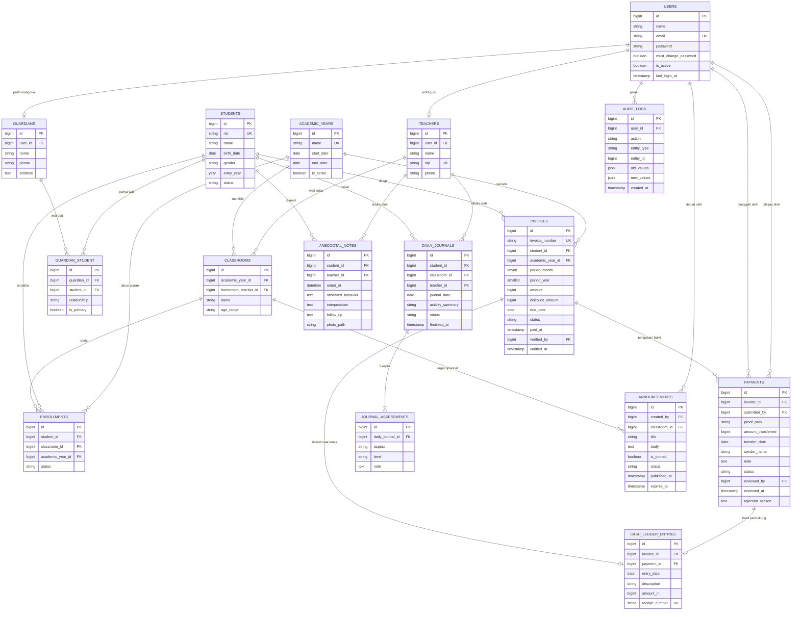
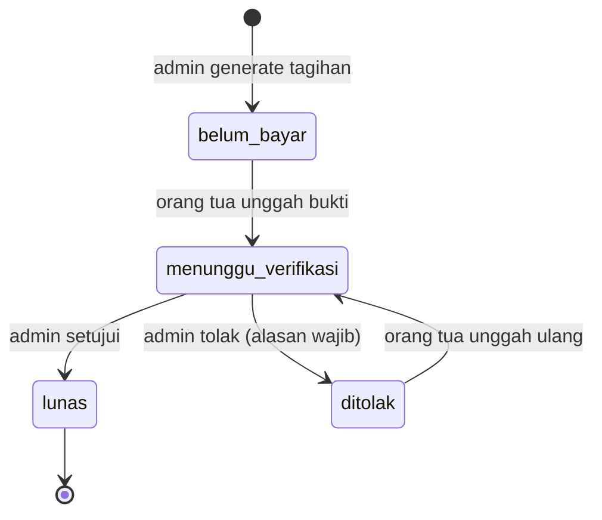

# ERD dan Aturan Data — SKMS

Basis data: MySQL. Konvensi: nama tabel jamak snake_case, primary key `id` (bigint unsigned), `created_at` dan `updated_at` di semua tabel, uang dalam **integer rupiah** (bukan float), foreign key ketat dengan `ON DELETE RESTRICT` kecuali disebut lain. Peran pengguna memakai tabel spatie/laravel-permission (`roles`, `permissions`, `model_has_roles`, dan seterusnya) dengan 4 role: `admin`, `guru`, `kepala_sekolah`, `orang_tua`.

## 1. Diagram

Tabel pendukung tanpa relasi di diagram: `school_settings` (key, value: `school_name`, `school_address`, `school_phone`, `bank_name`, `bank_account_number`, `bank_account_holder`, `default_spp_amount`), serta tabel bawaan Laravel (`password_reset_tokens`, `sessions`, `jobs`).

## 2. Nilai enum

| Kolom | Nilai |
|---|---|
| `students.status` | `aktif`, `nonaktif` |
| `students.gender` | `L`, `P` |
| `enrollments.status` | `aktif`, `pindah`, `selesai` |
| `guardian_student.relationship` | `ayah`, `ibu`, `wali` |
| `invoices.status` | `belum_bayar`, `menunggu_verifikasi`, `lunas`, `ditolak` |
| `payments.status` | `menunggu`, `disetujui`, `ditolak` |
| `daily_journals.status` | `draf`, `final` |
| `journal_assessments.aspect` | `nilai_agama_moral`, `fisik_motorik`, `kognitif`, `bahasa`, `sosial_emosional` |
| `journal_assessments.level` | `BB` (belum berkembang), `MB` (mulai berkembang), `BSH` (berkembang sesuai harapan), `BSB` (berkembang sangat baik) |
| `announcements.status` | `draf`, `terbit` |

## 3. Constraint dan indeks penting

- `invoices`: UNIQUE (`student_id`, `period_month`, `period_year`); nominal akhir = `amount - discount_amount`; indeks pada `status`, `due_date`.
- `enrollments`: UNIQUE (`student_id`, `academic_year_id`). Kelas siswa pada tahun ajaran aktif ditentukan dari tabel ini, sehingga kenaikan kelompok tidak menghapus riwayat.
- `classrooms`: UNIQUE (`academic_year_id`, `name`). Satu guru menjadi wali paling banyak satu kelas per tahun ajaran.
- `guardian_student`: UNIQUE (`guardian_id`, `student_id`). Seorang siswa memiliki minimal satu wali.
- `daily_journals`: UNIQUE (`student_id`, `journal_date`).
- `journal_assessments`: UNIQUE (`daily_journal_id`, `aspect`). Jurnal final wajib memiliki kelima aspek.
- `cash_ledger_entries`: UNIQUE (`invoice_id`) dan UNIQUE (`receipt_number`); entri hanya dibuat oleh sistem dan tidak dapat diubah atau dihapus lewat UI. Nomor kuitansi berformat `KWT/YYYY/MM/NNN`.
- `users.email` UNIQUE; `teachers.nip` UNIQUE; `students.nis` UNIQUE (format `2425-014`); `invoices.invoice_number` UNIQUE (format `INV-2026-10-071`).

## 4. State machine status tagihan

Aturan transisi (diterapkan di `PaymentVerificationService`):
1. Hanya `belum_bayar` dan `ditolak` yang dapat menerima unggahan bukti. Setiap unggahan membuat satu baris `payments` berstatus `menunggu`.
2. Hanya `admin` yang dapat menyetujui atau menolak, dan hanya untuk pembayaran `menunggu`.
3. **Setuju:** `payments.status = disetujui`, `invoices.status = lunas`, isi `paid_at`, `verified_by`, `verified_at`, dan buat satu `cash_ledger_entries` (`amount_in` = nominal akhir tagihan), semuanya dalam satu transaksi database.
4. **Tolak:** `payments.status = ditolak` dengan `rejection_reason`, `invoices.status = ditolak`.
5. `lunas` bersifat final: tidak ada transisi keluar, nominal tidak dapat diubah.
6. Setiap transisi dicatat di `audit_logs`.
7. Label "terlambat N hari" ditampilkan bila `due_date` lewat dan status bukan `lunas` (dihitung, tidak disimpan).

## 5. Aturan bisnis data

- **Akun otomatis:** saat admin membuat guru atau orang tua baru, sistem membuat `users` (role sesuai), kata sandi sementara acak, `must_change_password = true`. Kata sandi ditampilkan sekali. Untuk kakak-adik, `guardians` yang sudah ada dipilih ulang, bukan dibuat baru.
- **Hak akses data:** orang tua hanya data siswa yang terhubung lewat `guardian_student`; guru hanya siswa yang `enrollments`-nya berada di kelas yang ia walikan pada tahun ajaran aktif; kepala sekolah hanya baca; admin penuh kecuali jurnal dan anekdot (hanya baca).
- **Jendela edit jurnal:** jurnal `final` dapat diubah guru pembuatnya sampai akhir hari berikutnya (konfigurabel), lalu terkunci. Pesan UI contoh: "Jurnal sudah disimpan, bisa diubah sampai 2 Okt 2026."
- **Nonaktif, bukan hapus:** siswa, guru, dan orang tua tidak dihapus bila sudah punya transaksi atau jurnal; gunakan status nonaktif.
- **Ganti wali kelas:** guru lama kehilangan akses tulis ke kelas itu pada saat penggantian.
- **Nominal SPP:** default dari `school_settings.default_spp_amount`, dapat diubah per tagihan sebelum lunas (diskon dicatat di `discount_amount`).

## 6. Data demo (seeder)

Target seeder agar dashboard terlihat nyata dan konsisten antar layar:
- `school_settings`: `school_name = "TK Tunas Harapan"`; `school_address = "[ISI: alamat sekolah]"`; `school_phone = "[ISI: nomor telepon]"`; `bank_name = "[ISI: nama bank]"`; `bank_account_number = "[ISI: nomor rekening]"`; `bank_account_holder = "[ISI: nama pemilik rekening]"`; `default_spp_amount = [ISI: nominal SPP dalam rupiah]`.
- 1 tahun ajaran aktif 2026/2027 (dan 2025/2026 untuk riwayat), 2 kelas (Kelompok A dan B, masing-masing 39 siswa), 78 siswa aktif, sekitar 64 orang tua (beberapa punya dua anak), 12 guru dan staf, 1 admin, 1 kepala sekolah.
- Tagihan Okt 2026 untuk 78 siswa: 63 lunas, 9 menunggu verifikasi, 6 belum bayar (dua di antaranya terlambat); tagihan Agu dan Sep dengan campuran status, termasuk beberapa `ditolak` dan beberapa tunggakan lebih dari 30 hari.
- Jurnal harian 17 hari sekolah di Oktober dengan keterisian sekitar 92% (Kelompok A) dan 74% (Kelompok B), disertai beberapa catatan anekdot.
- 3 sampai 6 pengumuman (satu disematkan, satu draf, satu kedaluwarsa).
- Akun demo: `admin@skms.test`, `guru@skms.test`, `kepsek@skms.test`, `ortu@skms.test` (kata sandi demo di README, bukan di repo publik).
- **Catatan:** angka pada mockup (misalnya 61 transaksi, Rp 21.350.000) hanya ilustrasi dan tidak perlu sama persis dengan seeder.
